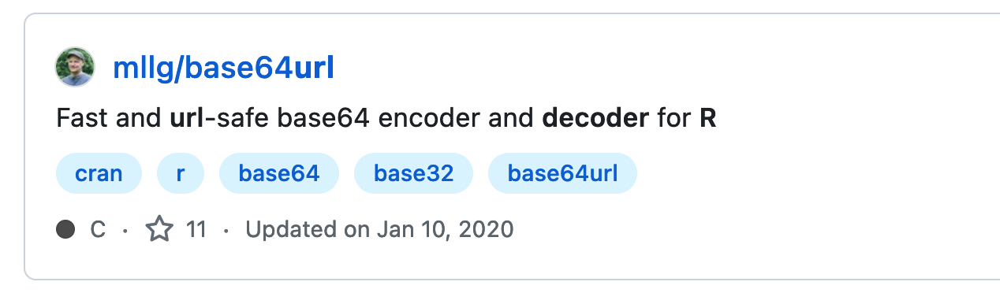

This is a brief explanation of ghFuns.R


If you use
```
library(RCurl)
library(XML)
source("ghFuns.R")

z = ghSearch("R URL decode")
```
you should get a list with 75 elements.
Each element corresponds to a repository in the search results for this search query string "R URL decode".

In the ghSearch() function, we make the initial HTTP request to get the first page of results for
this query.  We get back an HTML page.  This contains the first 10 results from the search.

We have to find these in the HTML page.  

We do this via processResults() using an XPath query to get the relevant `<li>`  (list element)
nodes.  
The XPath query is
```xpath
//ul[@class = 'repo-list']/li
```
This says:
+ start at the top of the HTML tree and descend through all the nodes in the tree looking
  for any node named `ul`  (unordered list.)
+ When you find a `ul` node, check if its class attribute is the string `repo-list`.
+ If it is, we have a match for this *step* in the XPath expression and so we start from
there for the next step in the XPath expression. 
+ This next sep is `/li` and so we are looking for 
    any child nodes of this `ul` 
	
The first of these `<li>` looks like
```
<li class="repo-list-item hx_hit-repo d-flex flex-justify-start py-4 public source">
  <div class="flex-shrink-0 mr-2">
      <svg style="color: #6a737d" aria-hidden="true" height="16" viewbox="0 0 16 16" version="1.1" width="16" data-view-component="true" class="octicon octicon-repo"><path d="M2 2.5A2.5 2.5 0 0 1 4.5 0h8.75a.75.75 0 0 1 .75.75v12.5a.75.75 0 0 1-.75.75h-2.5a.75.75 0 0 1 0-1.5h1.75v-2h-8a1 1 0 0 0-.714 1.7.75.75 0 1 1-1.072 1.05A2.495 2.495 0 0 1 2 11.5Zm10.5-1h-8a1 1 0 0 0-1 1v6.708A2.486 2.486 0 0 1 4.5 9h8ZM5 12.25a.25.25 0 0 1 .25-.25h3.5a.25.25 0 0 1 .25.25v3.25a.25.25 0 0 1-.4.2l-1.45-1.087a.249.249 0 0 0-.3 0L5.4 15.7a.25.25 0 0 1-.4-.2Z"/></svg></div>

  <div class="mt-n1 flex-auto">
    <div class="d-flex">
      <div class="f4 text-normal">
        <a class="v-align-middle" data-hydro-click="{&quot;event_type&quot;:&quot;search_result.click&quot;,&quot;payload&quot;:{&quot;page_number&quot;:1,&quot;per_page&quot;:10,&quot;query&quot;:&quot;R URL decode&quot;,&quot;result_position&quot;:1,&quot;click_id&quot;:69953146,&quot;result&quot;:{&quot;id&quot;:69953146,&quot;global_relay_id&quot;:&quot;MDEwOlJlcG9zaXRvcnk2OTk1MzE0Ng==&quot;,&quot;model_name&quot;:&quot;Repository&quot;,&quot;url&quot;:&quot;https://github.com/mllg/base64url&quot;},&quot;originating_url&quot;:&quot;https://github.com/search?q=R%20URL%20decode&amp;type=repositories&quot;,&quot;user_id&quot;:null}}" data-hydro-click-hmac="2acd13371b114dd160e2d34ec01ed113c1ad16ab881303e290288eb6f8966af6" href="/mllg/base64url">mllg/base64<em>url</em></a>

      </div>

    </div>

      <p class="mb-1">
        Fast and <em>url</em>-safe base64 encoder and <em>decoder</em> for <em>R</em>
      </p>

    <div>
        <div>
            <a data-ga-click="Topic, search results" data-octo-click="topic_click" data-octo-dimensions="topic:cran,repository_id:69953146,repository_nwo:mllg/base64url,repository_public:true,repository_is_fork:false" href="/topics/cran" title="Topic: cran" data-view-component="true" class="topic-tag topic-tag-link f6 px-2 mx-0">
  cran
</a>
            <a data-ga-click="Topic, search results" data-octo-click="topic_click" data-octo-dimensions="topic:r,repository_id:69953146,repository_nwo:mllg/base64url,repository_public:true,repository_is_fork:false" href="/topics/r" title="Topic: r" data-view-component="true" class="topic-tag topic-tag-link f6 px-2 mx-0">
  r
</a>
            <a data-ga-click="Topic, search results" data-octo-click="topic_click" data-octo-dimensions="topic:base64,repository_id:69953146,repository_nwo:mllg/base64url,repository_public:true,repository_is_fork:false" href="/topics/base64" title="Topic: base64" data-view-component="true" class="topic-tag topic-tag-link f6 px-2 mx-0">
  base64
</a>
            <a data-ga-click="Topic, search results" data-octo-click="topic_click" data-octo-dimensions="topic:base32,repository_id:69953146,repository_nwo:mllg/base64url,repository_public:true,repository_is_fork:false" href="/topics/base32" title="Topic: base32" data-view-component="true" class="topic-tag topic-tag-link f6 px-2 mx-0">
  base32
</a>
            <a data-ga-click="Topic, search results" data-octo-click="topic_click" data-octo-dimensions="topic:base64url,repository_id:69953146,repository_nwo:mllg/base64url,repository_public:true,repository_is_fork:false" href="/topics/base64url" title="Topic: base64url" data-view-component="true" class="topic-tag topic-tag-link f6 px-2 mx-0">
  base64url
</a>
        </div>

      <div class="d-flex flex-wrap text-small color-fg-muted">

          <div class="mr-3">
            <a class="Link--muted" href="/mllg/base64url/stargazers">
              <svg aria-label="star" role="img" height="16" viewbox="0 0 16 16" version="1.1" width="16" data-view-component="true" class="octicon octicon-star"><path d="M8 .25a.75.75 0 0 1 .673.418l1.882 3.815 4.21.612a.75.75 0 0 1 .416 1.279l-3.046 2.97.719 4.192a.751.751 0 0 1-1.088.791L8 12.347l-3.766 1.98a.75.75 0 0 1-1.088-.79l.72-4.194L.818 6.374a.75.75 0 0 1 .416-1.28l4.21-.611L7.327.668A.75.75 0 0 1 8 .25Zm0 2.445L6.615 5.5a.75.75 0 0 1-.564.41l-3.097.45 2.24 2.184a.75.75 0 0 1 .216.664l-.528 3.084 2.769-1.456a.75.75 0 0 1 .698 0l2.77 1.456-.53-3.084a.75.75 0 0 1 .216-.664l2.24-2.183-3.096-.45a.75.75 0 0 1-.564-.41L8 2.694Z"/></svg>
              11
            </a>
          </div>

          <div class="mr-3">
            <span class="">
  <span class="repo-language-color" style="background-color: #555555"/>
  <span itemprop="programmingLanguage">C</span>
</span>

          </div>


          <div class="mr-3">
            Updated <relative-time datetime="2020-01-11T00:16:31Z" class="no-wrap">Jan 11, 2020</relative-time></div>

      </div>
    </div>
  </div>
</li> 
```

and this is displayed in the Web page as




From this `<li>` subnode, we want to extract the 

+ repos link
+ description
+ tags
+ number of stars
+ programming language
+ date

We do this with a separate XPath query for each of these
and we do this in the `procResult()` function.


For the number of stars, we can find the node that contains the text `11` that we see in the Web
page for this repository result.
Of course, we want to generalize this to all result `<li>` across all pages of results.
So we are looking for a general pattern that identifies the number of stars generally,
but learning from this particular one and generalizing.

The "11" is in this sub-tree
```
          <div class="mr-3">
            <a class="Link--muted" href="/mllg/base64url/stargazers">
              <svg aria-label="star" role="img" height="16" viewbox="0 0 16 16" version="1.1" width="16" data-view-component="true" class="octicon octicon-star"><path d="M8 .25a.75.75 0 0 1 .673.418l1.882 3.815 4.21.612a.75.75 0 0 1 .416 1.279l-3.046 2.97.719 4.192a.751.751 0 0 1-1.088.791L8 12.347l-3.766 1.98a.75.75 0 0 1-1.088-.79l.72-4.194L.818 6.374a.75.75 0 0 1 .416-1.28l4.21-.611L7.327.668A.75.75 0 0 1 8 .25Zm0 2.445L6.615 5.5a.75.75 0 0 1-.564.41l-3.097.45 2.24 2.184a.75.75 0 0 1 .216.664l-.528 3.084 2.769-1.456a.75.75 0 0 1 .698 0l2.77 1.456-.53-3.084a.75.75 0 0 1 .216-.664l2.24-2.183-3.096-.45a.75.75 0 0 1-.564-.41L8 2.694Z"/></svg>
              11
            </a>
          </div>
```
We want the text "11" and we find it in the `<a>` node.  We can't just look for all `<a>` nodes in
the `<li>` for this repository result.  There are several `<a>` nodes. We are looking for the one
associated with the number of stars.

The URL for the `<a>` has an `href` attribute that ends with `/stargazers`.
We'll hope this pattern works for other `<li>` repository results.
We look at a few of these to confirm, e.g.,
```r
getNodeSet(doc, "//a[contains(@href, '/stargazers')]")
```
where `doc` is the parsed HTML document for the first page of results.

We see there are 10 of these - 1 for each of the 10 repository results.

So we can get the number of stars for this specific `<li>` result - and each `<li>` result - with
```
xpathSApply(x, ".//a[contains(@href, '/stargazers')]", xmlValue)
```

We use ".//a...", i.e., a starting `.` in the XPath expression because we are starting our search
at this `<li>` node, not the top of the HTML document. 

xpathSApply() is equivalent to `sapply(getNode(x, xpathQuery), function)` and is just short-hand.

xmlValue() gets the text of a node, i.e., the text of its children, its children's children, etc.,
i.e., all descendants.


We use XPath to get the tags, the user information, the datetime, etc. by finding the relevant
node in our example and then writing the XPath to get that node and only that node for the
information we want.


Once we processed all the results on a page of search results, 
the next step is to get the next page of results and process those.
And we'll repeat this until there are no more result pages.

The URL for the next page of results is in the first page of results.
If we click on the Next button near the bottom of the page


We'll find that HTML element and get its hyperlink

Looking in the HTML of the first page of results for the word Next, we find 
only one occurence and it is in the node
```
<a class="next_page" rel="next" href="/search?p=2&amp;q=R+URL+decode&amp;type=Repositories">Next</a>
```
We want the 
```
/search?p=2&amp;q=R+URL+decode&amp;type=Repositories
```
i.e., the href attribute.

So we can find this with

```r
nxt = getNodeSet(doc, "//a[. = 'Next']/@href")[[1]]
```
or
```
nxt = getNodeSet(doc, "//a[@class = 'next_page"]/@href")[[1]]
```
(We use `[[1]]` as there is one result and we want it as a character vector.)


This is not a URL, but a path within the Web server plus arguments.
It is part of the URL we want. We need to add the https://github.com.
More specifically, we need to interpret this path relative to the URL
of our original query.
We use
```
nextURL = getRelativeURL(nxt, "http://github.com/search")
[1] "http://github.com/search?p=2&q=R+URL+decode&type=Repositories"
```

We can pass this to getURLContent() along with the necessary HTTP request headers to get the next
page of results.
